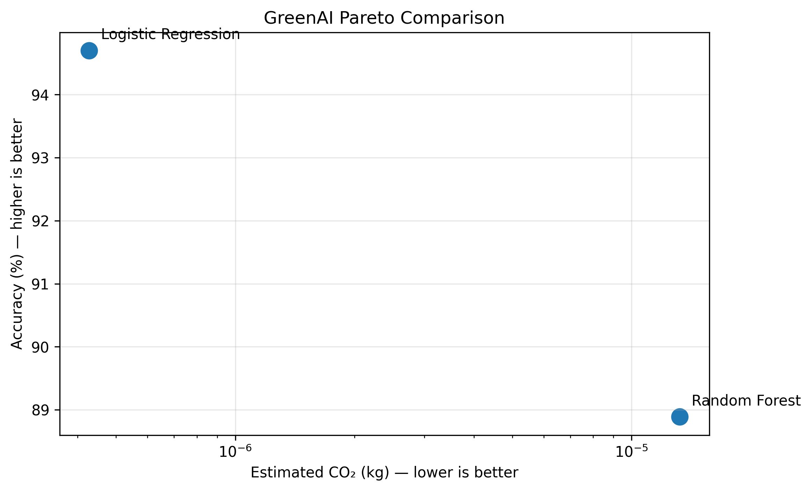

# GreenAI Benchmark 🌱🤖

A practical benchmark for comparing machine-learning models not only by accuracy, but also by computational cost, inference time, model size, complexity, and estimated CO₂ emissions.

## 📌 Overview

Machine-learning model selection is often focused mainly on accuracy. However, different models can require very different computational resources.

This project explores that trade-off by comparing two models on the same binary text-classification task:

- Logistic Regression — lower-compute baseline
- Random Forest — higher-compute ensemble model

The benchmark evaluates:

- Accuracy
- Training time
- Estimated CO₂ emissions
- Inference time
- Saved model size
- Model complexity
- Robustness across different train/test splits
- Inference scaling

The goal is not to declare one model universally better, but to demonstrate why computational and environmental costs can be considered alongside predictive performance.

## 🧪 Dataset

The experiment uses the **20 Newsgroups** dataset from scikit-learn.

Two categories were selected:

- `rec.autos`
- `sci.space`

After preprocessing:

- Total samples: 1,977
- Number of classes: 2
- Train/test split: 80/20
- TF-IDF features: up to 5,000
- Stop words: English

Headers, footers, and quoted text were removed.

## ⚙️ Models

### Logistic Regression

Used as the lower-compute baseline.

- `max_iter = 1000`

### Random Forest

Used as the higher-compute ensemble model.

- 300 trees
- `random_state = 42`
- `n_jobs = -1`

## 📊 Main Benchmark Results

| Metric | Logistic Regression | Random Forest |
|---|---:|---:|
| Accuracy | 94.70% | 88.89% |
| Training Time | 0.531 s | 4.710 s |
| Estimated CO₂ | 4.28 × 10⁻⁷ kg | 1.32 × 10⁻⁵ kg |
| Saved Model Size | 0.039 MB | 12.999 MB |
| Inference Time / prediction | 0.000479 s | 0.095906 s |
| Complexity | 5,001 parameters | 300 trees / 169,184 nodes |

In this experiment, Random Forest required:

- 8.9× more training time
- 30.9× higher estimated CO₂
- 200.2× higher inference time
- 334.7× larger saved model file

The CO₂ comparison is indicative rather than a direct measurement. The runs were short, and CodeCarbon estimates can be sensitive to hardware, runtime, and carbon-intensity assumptions.

Its accuracy was 5.81 percentage points lower in the main benchmark.

## 🔬 Robustness Test

The models were also evaluated across five different train/test splits.

| Model | Mean Accuracy | Std. Accuracy | Mean Training Time |
|---|---:|---:|---:|
| Logistic Regression | 92.63% | 1.68% | 0.032 s |
| Random Forest | 89.19% | 1.26% | 3.571 s |

Across these five splits, the mean accuracy difference was 3.43 percentage points.

The timing values in this five-split experiment were measured separately from the main CodeCarbon-tracked benchmark, so they are not directly comparable to the main benchmark timings. Differences can arise from run conditions and measurement/tracking overhead.

The mean training time was much higher for Random Forest in this separate timing experiment.

## 📈 Inference Scaling

Inference time was tested with increasing workloads.

The values below represent the **total inference time for the full batch**, not the time for a single prediction.

| Samples | Logistic Regression (s) | Random Forest (s) | RF / LR |
|---:|---:|---:|---:|
| 100 | 0.000407 | 0.086658 | 212.7× |
| 1,000 | 0.000402 | 0.129561 | 322.5× |
| 10,000 | 0.001151 | 0.692296 | 601.4× |

The larger workload test demonstrates why inference efficiency can become relevant when a model is used repeatedly at scale.

## 🌱 GreenAI Perspective

The project uses a multi-metric approach rather than evaluating models using accuracy alone.

A model can be evaluated through:

**Performance + Computational Cost + Inference Cost + Model Footprint**

The benchmark also uses a Pareto-style comparison between accuracy and estimated CO₂ to visualize the trade-off.



The findings are specific to this dataset, model configurations, and computing environment. They should not be interpreted as evidence that one model type is always more environmentally efficient than another.

## ⚠️ Limitations

- The benchmark uses one dataset and two model types.
- Results depend on the model configurations and computing environment.
- CO₂ values are estimates generated using CodeCarbon, not direct measurements.
- The CO₂ runs were short, so the reported difference should be treated as indicative rather than a precise estimate of real-world emissions.
- The experiment was performed in Google Colab.
- CodeCarbon may use estimated/default hardware power and carbon-intensity values when complete runtime or geographic information is unavailable.
- Water consumption was not measured by this experiment.
- Saved model size refers to the serialized model artifact, not total infrastructure requirements.
- Inference scaling reused the available test data to create larger batches; it does not represent 10,000 unique documents.

## 🚀 Future Work

Possible extensions include:

- Testing additional datasets
- Adding more model architectures
- Running experiments across different hardware
- Measuring energy consumption directly where possible
- Evaluating additional environmental metrics
- Building an interactive GreenAI benchmarking dashboard
- Comparing accuracy–cost trade-offs across larger model families

## 🛠️ Technologies

- Python
- Google Colab
- Scikit-learn
- Pandas
- NumPy
- Matplotlib
- CodeCarbon
- TF-IDF
- GitHub

## ▶️ How to Run

### Requirements

The project includes a `requirements.txt` file containing the required Python packages.

Install the dependencies with:

```bash
pip install -r requirements.txt
